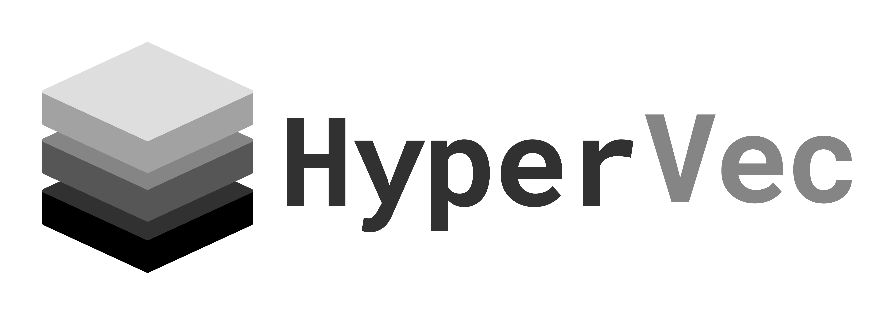

A public Open-Source Library for Safely Handling Dynamic Vector Operations in C

---

HyperVec is a powerful and efficient open-source library designed to optimize dynamic vector operations in the C programming language while prioritizing safety. It is tailored to provide high performance and versatility for handling dynamically resizable arrays making it a valuable tool for a wide range of applications. Whether you are working on scientific simulations, data processing, AI, or any C-based project that requires dynamic arrays, HyperVec can help you achieve better performance and productivity.

---